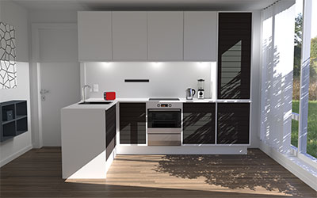
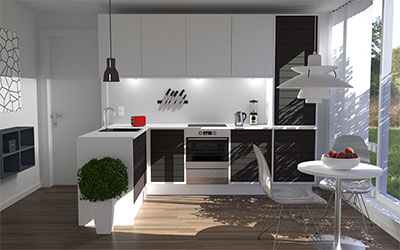
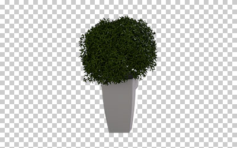
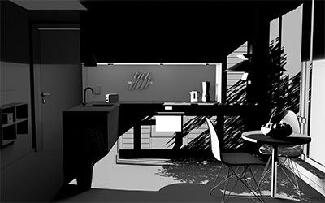
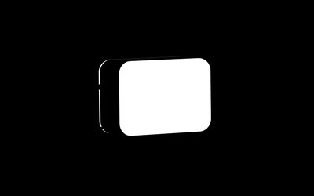
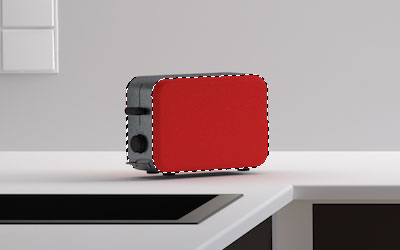

# Kitchen - FSI Layers Configurator Example

This demo shows a simple configurator based on *FSI Layers*.

In order not to make the demo too complex, the layers were all described as HTML tag and only the function change of the layers in JavaScript is explained here.

### Description

The controls are implemented in Bootstrap for simplicity for this demo.

All elements in the index.html file below the ```<fsi-layers>``` tag are for configurator controls only and can be replaced as desired.

The template ``{{{sources.images}}}`` in the src attribute is replaced by Grunt by the variables written in the env.yml project file.

In the JavaScript class "Kitchen" only the method ``cfgChange`` is relevant.
This class is initialized by *FSI-Layers* with the callback ``onReady``. The FSI Layers element is saved as a class property, and the side menu is initialized.

The ``cfgChange`` method reacts to the element ID of the called element. Depending on this, a new property value is passed to an assigned layer.
After that, FSI Layers is told to recalculate the layers.

```javascript
this.layers.setProperties([layerName], newProps)
this.layers.render()
```

Depending on the connection, reloading other layers can take a while,therefore the event callback ``onLoadChange``is defined in the ``<fsi-layers>`` element.
This method fades a spinner loading element in and out.

### How to create an own images for a configurator with FSI Layers

Depending on whether real photographs or a CGI (computer generated image)
is used as basis, the preparatory work for creating the layers can be
more or less complicated.

In this example, a CGI was created with Maxon Cinema 4D.
Two scenes were rendered for this purpose.

One without equipment:



And a scene with everything that should be addable.



Alpha channels have been automatically created for certain objects.
This makes it easy to select and crop individual objects in an
image processing program, like Photoshop, Affinity or GIMP.



In this scene the shadow is also very important - therefore it makes sense to calculate it separately if possible and to assign it to the layers accordingly.



If certain objects should be colored by the image server, a path or an alpha channel must be stored.
In this example, the toaster has an alpha channel for the colored surface.




With the ``effect`` parameter the whole(!) image will be reloaded.
This is not really useful, but for the sake of completion it is shown here in this demo,
so you can see how something like this would work.


### Testing with images from your own server

To test the examples with images from your own [FSI Server](https://www.neptunelabs.com/fsi-server/), please first copy the env.yml.dist file to env.yml and adapt the file, then restart the main demo again.
